# 아이유정

## 💁 서비스 소개
### **"아이들에게 유익한 입지 정보를 얻고 싶은 부모를 위한 부동산 추천 서비스"**
🫶 Naming : **아이**들에게 **유**리한 입지 **정**보를 제공하겠다는 마음을 줄임말로 표현
<br>
가장 중요한 학군, 학원 정보부터 치안(CCTV, 경찰서), 교통, 문화, 편의시설을 고려해 건물 인근의 인프라에 대한 통합 추천 점수를 제공.
<br>
- 🔗 LINK : https://j8e103.p.ssafy.io/ (배포 중)
- 🎼 Period : 2023.02.27 ~ 2023.04.07 (6인 6주)
- 📑 Notion : https://gratis-ceder-84d.notion.site/E103-6bc4a5224d6f4ad2a70471f631026a95

## ✨ 기능 및 화면
### 1) 메인 페이지 및 구글 로그인

``` bash
- 추천 뉴스 : 최근 검색 기록을 기반으로 연관된 학군에 대한 뉴스를 추천
```
<br>

### 2) 선호 필터 적용


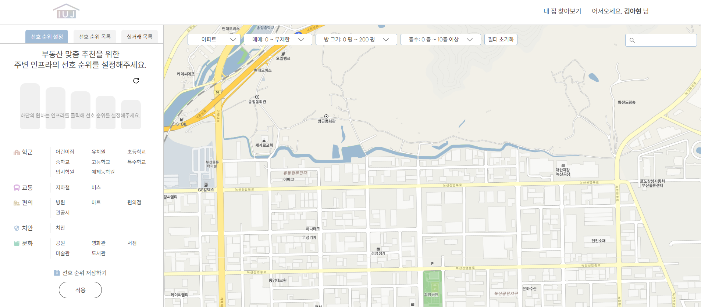

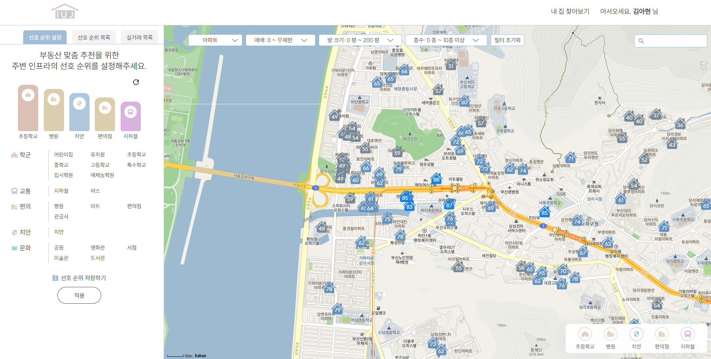

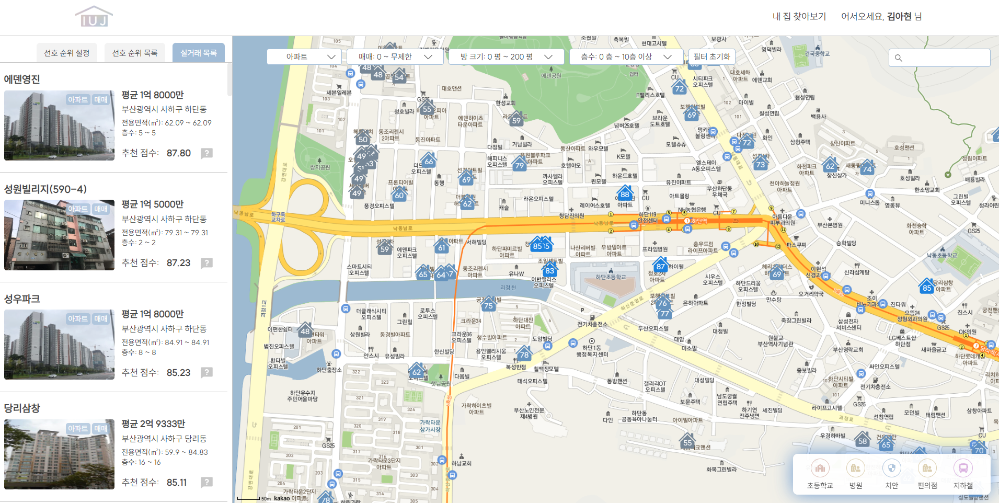

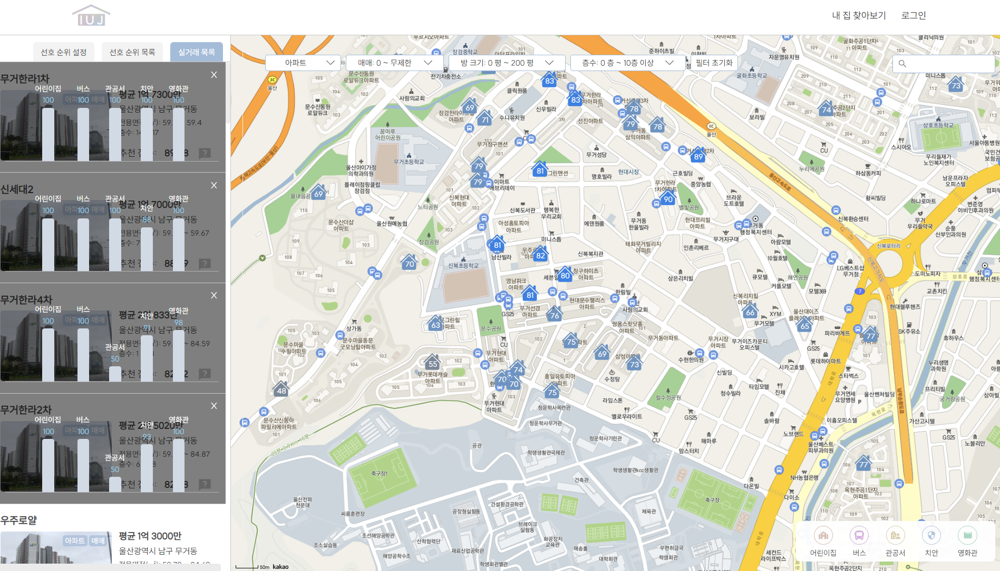

``` bash
- 선호 필터 : 학군, 교통, 문화, 치안, 편의시설 카테고리 내 세부사항을 선택
- 추천 점수 마커 : 지도 위 마커를 통해 해당 건물(매물)의 추천 점수를 확인.
  추천 점수가 높을수록 색상을 진하게 해 유저의 인지 편의를 도움
- 추천 점수 그래프 : 리스트 내 해당 건물의 물음표를 클릭 시 추천 점수에 대한 근거 그래프 제공
```

<br>

### 3) 다양한 필터
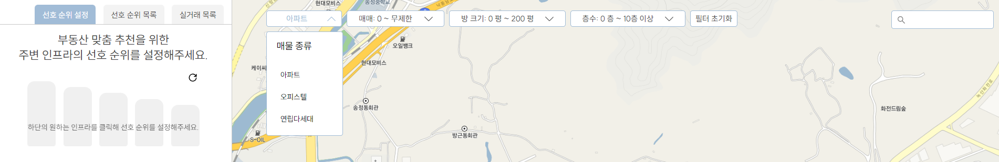

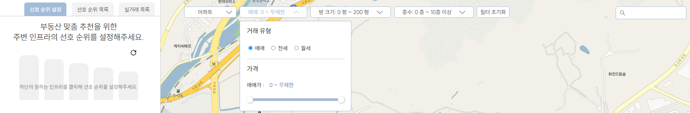


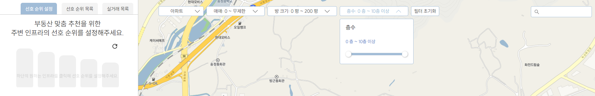

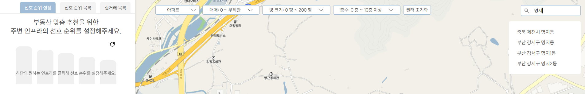

<br>

### 4) 건물 상세 페이지
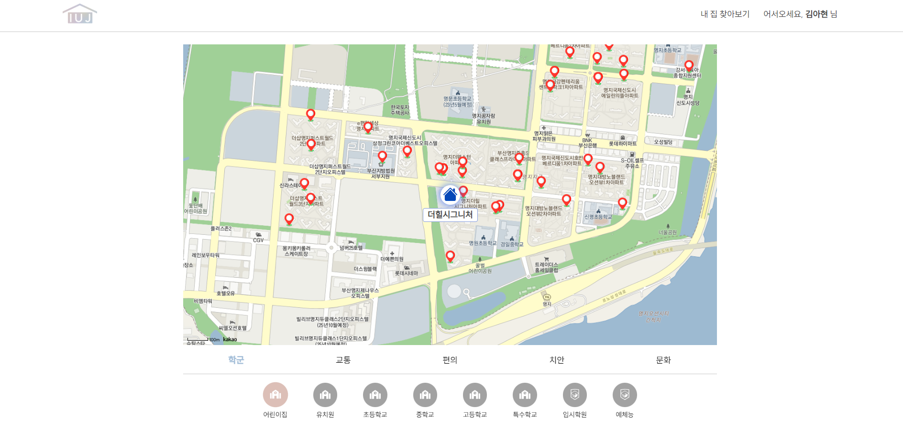

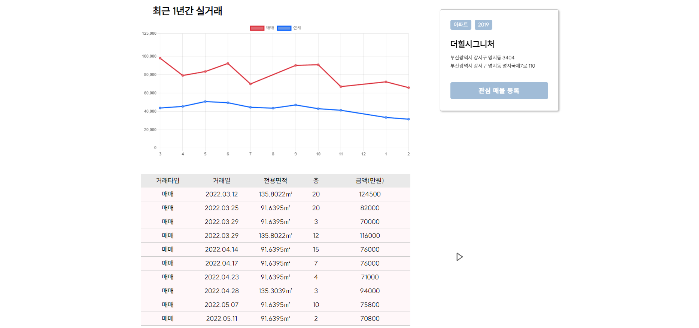


``` bash
- 인프라 지도 : 현 건물(매물) 인근의 카테고리별 주변 시설 위치를 한눈에 확인 가능
- 실거래가 그래프 : 최근 1년의 매매, 전세 실거래가 그래프 제공
- 인근 학군 정보 : 현 건물(매물) 위치에서 다양한 학교 및 학원 간의 거리 제공
```

<br>

### 5) 관심매물 페이지
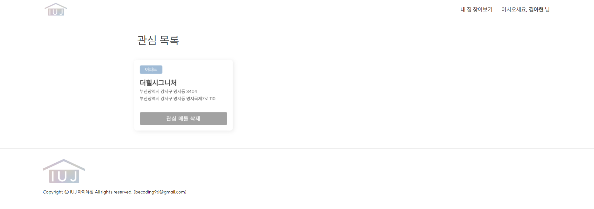

<br>

## 🖥️ 실행 방법
[포팅메뉴얼](/exec/E103_포팅_메뉴얼.pdf) 참고
### 1) 버전 정보
```
- 호스트 머신(EC2) 설정
    - Ubuntu : `20.04.6 LTS`
    - Docker : `23.0.1`
    - Docker-compose : `1.25.0`
- Frontend 설정
    - Node : `18.13.0`
    - npm : `9.3.1`
    - Nginx : `nginx/1.18.0 (Ubuntu)`
- Backend 설정
    - openjdk version : `jdk-11.0.17`
    - Java(TM) SE Runtime Environment 18.9 (build 11.0.17+10-LTS-269)
    - Java HotSpot(TM) 64-Bit Server VM 18.9 (build 11.0.17+10-LTS-269, mixed mode)
    - Spring Framework : `5.3.24`
    - Spring Boot : `2.7.7`
- IDE 설정
    - IntelliJ : `2022.3.1`
```

### 2) Dockerfile 및 docker-compose.yml 작성
- docker-compose.yml
```bash
version: '3'

services:
        jenkins:
                image: jenkins/jenkins:lts
                container_name: jenkins
                volumes:
                        - /usr/bin/docker:/usr/bin/docker
                        - /var/run/docker.sock:/var/run/docker.sock
                        - /jenkins:/var/jenkins_home
                ports:
                        - "9090:8080"
                privileged: true
                user: root
                environment:
                        TZ: "Asia/Seoul"
        nginx:
                image: nginx:stable-alpine
                container_name: nginx
                restart: unless-stopped
                ports:
                        - "80:80"
                        - "443:443"
                volumes:
                        - ./data/nginx/nginx.conf:/etc/nginx/conf.d/nginx.conf
                        - ./data/certbot/conf:/etc/letsencrypt
                        - ./data/certbot/www:/var/www/certbot
                command: "/bin/sh -c 'while :; do sleep 6h & wait $${!}; nginx -s reload; done & nginx -g \"daemon off;\"'"
                environment:
                        TZ: "Asia/Seoul"

        certbot:
                image: certbot/certbot
                container_name: certbot
                volumes:
                         - ./data/certbot/conf:/etc/letsencrypt
                         - ./data/certbot/www:/var/www/certbot
                entrypoint: "/bin/sh -c 'trap exit TERM; while :; do certbot renew; sleep 12h & wait $${!}; done;'"
                environment:
                        TZ: "Asia/Seoul"
```

<br>

- react Dockerfile
``` bash
FROM node:16.15.0 as build-stage
COPY package.json .
RUN npm install
COPY . .
RUN npm run build

FROM nginx:stable-alpine as production-stage
COPY --from=build-stage dist /usr/share/nginx/html
EXPOSE 8080
CMD ["nginx", "-g","daemon off;"]
```

- spring boot Docker file
``` bash
FROM adoptopenjdk/openjdk11 AS builder
COPY gradlew .
COPY gradle gradle
COPY build.gradle .
COPY settings.gradle .
COPY src src
RUN chmod +x ./gradlew
RUN ./gradlew bootJAR

FROM adoptopenjdk/openjdk11
COPY --from=builder build/libs/*.jar app.jar
EXPOSE 8080
ENTRYPOINT ["sh", "-c", "java ${JAVA_ENC} ${PROFILE} -jar /app.jar"]
```
환경 변수는 젠킨스에서 주입 후 빌드 진행
- JAVA_ENC : Jasypt 적용한 secret key
- PROFILE : Spring boot의 profile 환경

<br>

### 3) 젠킨스 shell 작성
``` bash
docker build -t backimg ./backend
if (docker ps | grep "backimg"); then docker stop backimg; fi
docker run -it -d --rm -p 5000:5000 -e JAVA_ENC=-Djasypt.encryptor.password=NiceE103! -e PROFILE=-Dspring.profiles.active=prod --name backimg backimg
echo "Run backend"

docker build -t frontimg ./frontend
if (docker ps | grep "frontimg"); then docker stop frontimg; fi
docker run -it -d --rm -p 8080:80 -v /home/ubuntu/deploy/nginx/front.conf:/etc/nginx/conf.d/default.conf --name frontimg frontimg
echo "Run frontend"
```

### 4) 확인
#### - mysql 접속하여 [DB 덤프파일](/exec/E103_db_dump_20230406.sql) 실행

#### - 실행중인 컨테이너 확인
``` bash
docker ps
```

<br>

## 📝 설계
### 1) ERD
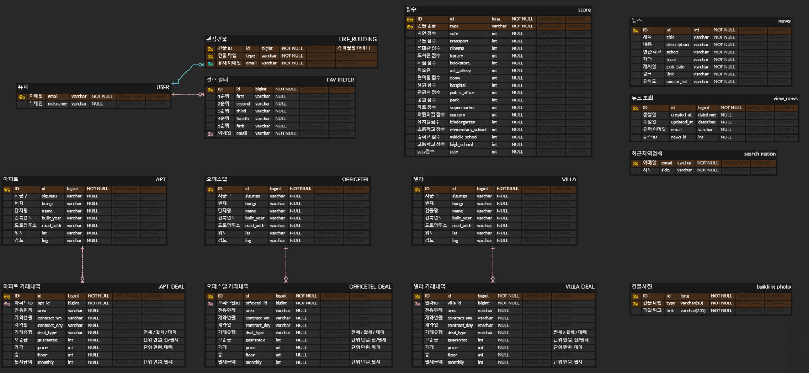

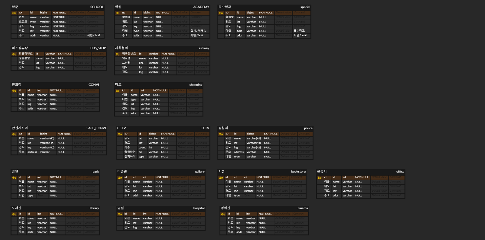


### 2) 기능 명세서
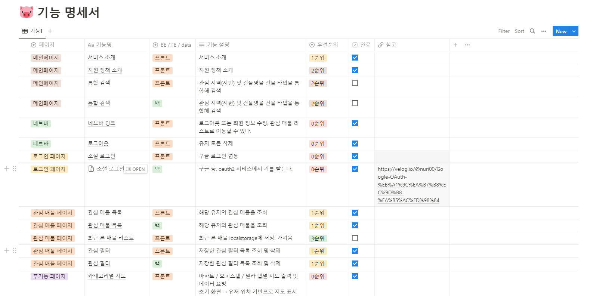


### 3) 아키텍처
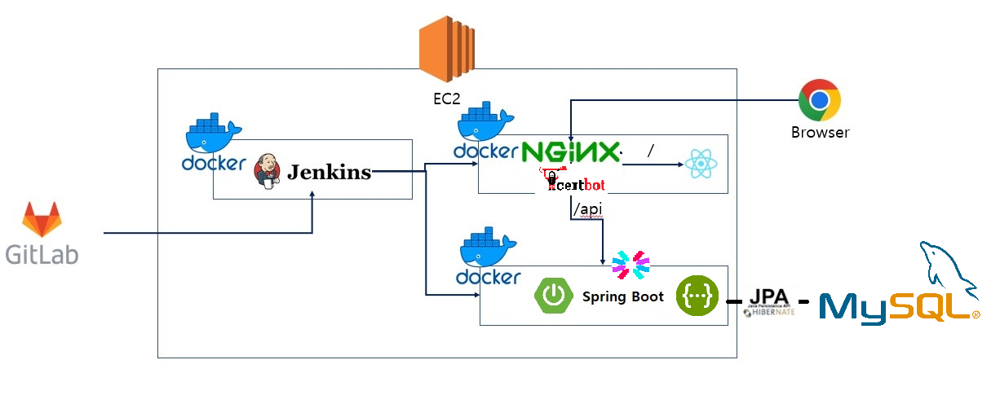


## 💙 팀원 소개


