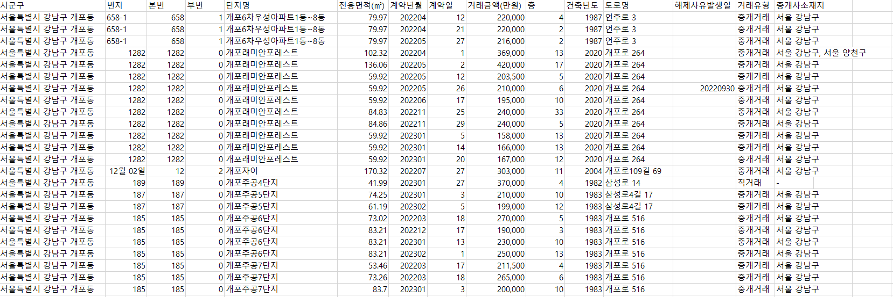

## :house: 학부모 및 신혼부부 최적입지 추천

<br>

### :star: 개요

_학부모에게 지역의 부동산 정보에 더해서 주변의 유리한 요소를(인프라) 합산한 점수를 제공하는 서비스입니다._

<br>

### :clipboard: 서비스 상세 (메인 기능)

1. 학군, 편의시설, 문화시설 등 주변 인프라 목록에서 사용자가 우선순위를 설정합니다.

2. 지역별로 우선순위를 고려한 부동산의 리스트를 제공 및 추천합니다. (게시판 or 지도 형태)

   - 부동산은 _아파트 매매/전세/월세, 단독다가구 매매/전세/월세, 연립다세대 매매/전세/월세, 오피스텔 매매/전세/월세_ 를 칭합니다.

3. 부동산 매물을 클릭하면 부동산 상세 페이지로 이동합니다.

4. 부동산 상세 페이지에는 해당 <u>부동산의 이름, 주소 등의 정보와</u> 지도 상의 위치, N년간 실거래가, 주변의 유치원/학교 정보, 어린이 교통사고 건수(점수에만 포함), 도서관, 학원, 인구 분포, 교통, 편의점/안전지킴이, CCTV 등의 추가 정보와 이 중 일부를 고려한 <u>최적입지 점수를 제공</u>합니다.

<br>
<br>

### :clipboard: 팀 규칙

1. Ground rule

(1) 의사소통

- 상대방이 이해할 수 있게 의사소통하기
- 상대의 말이 마음에 들지 않아도 끊지 않고 경청하기 (못 참겠으면 쿠션어 넣어서 말하기)
- 주어를 나로 정하고 말하기 (니가 ~해서 X, 내가 ~한데 O)
- 편하게 질문하고 성의 있게 답해주기
- 의견이 엇갈린다면 디스코드에 적고 토론하기
- 함께 협업하게 되면 잘 했든 못했든 처리 상황을 바로바로 보고하기

<br>

(2) 개발

- 일의 우선순위를 정할 때, 개인의 업무보다 협업이 필요한 업무 우선하기
- 잦은 커밋, 지라 활용을 통해 어떤 일을 하고 있는지 팀원이 알게 하기
- 안건을 정할 때, 일단 확실하게 결론을 내고 모두에게 공유 및 문서에 바로 업데이트

<br>

2. 코드컨벤션

(1) git 컨벤션

### a. branch

```bash
|-- main

		|-- front
		    |-- FE/feature1
		    |-- FE/feature2

		|-- back
		    |-- BE/feature1
		    |-- BE/feature2
```

같은 기능을 여러 명이 만질 때는 기능 뒤에 /이름 추가

ex)

```bash
FE/feature1/junbong
```

### b. commit message

```bash
# ✨ : 새로운 기능 추가
# 🐛 : 버그 수정
# 📚 : 문서 수정
# 🚨 : 테스트 코드 추가
# 🔨 : 코드 리팩토링
# 📝 : 코드 의미에 영향을 주지 않는 변경사항
# 🔧 : 기타 변경사항, 프로덕션 코드 변경사항 없음
```

<br>

(2) 백, 프론트

- 노션 링크 첨부 ('https://www.notion.so/c2ea01a1aa5441ea9c0a5466c9cbc52d')

<br>
<br>

### :signal_strength: 사용 데이터

- [국토교통부 실거래가 공개시스템](http://rtdown.molit.go.kr/) : 단독다가구 매매/전세/월세, 연립다세대 매매/전세/월세, 아파트 매매/전세/월세
  
- [한국교육학술정보원 유치원 공시정보](https://www.data.go.kr/data/15020786/openapi.do)
- [학교알리미](https://www.schoolinfo.go.kr/ng/go/pnnggo_a01_l0.do)
- [치안](https://www.bigdata-policing.kr/product/list?page=1&perPageNum=12&datepicker_type=all&sort_id=idx&product_category=1&orderby=create_date#review_content)
- [보행어린이 사고다발지역정보](https://taas.koroad.or.kr/api/selectChildDataSet.do)
- [전국도서관표준데이터](https://www.data.go.kr/data/15013109/openapi.do)
- 학원
- 인구
- 교통
- [편의점/안전지킴이](https://www.bigdata-policing.kr/product/view?product_id=PRDT_494)
- CCTV
